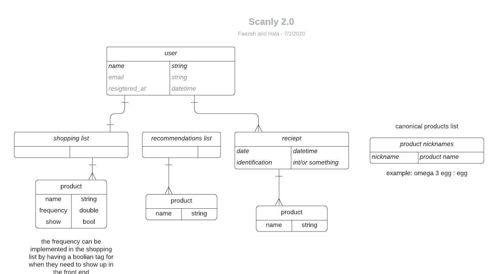

# Scanly (front end)

A new Flutter project.

## Getting Started

This project is a starting point for a Flutter application.

A few resources to get you started if this is your first Flutter project:

- [Lab: Write your first Flutter app](https://flutter.dev/docs/get-started/codelab)
- [Cookbook: Useful Flutter samples](https://flutter.dev/docs/cookbook)

For help getting started with Flutter, view our
[online documentation](https://flutter.dev/docs), which offers tutorials,
samples, guidance on mobile development, and a full API reference.
# scanly-flutter

## Table of Contents

* [Learning Goals](#learning-goals)
* [Statement](#statement)
* [Feature Set](#feature-set)
* [Target Audience](#target-audience)
* [Trello Board](#trello-board)
* [Wireframes](#wireframes)
* [Database Diagram](#database-diagram)
* [Technologies](#technologies)
* [Capstone Presentation Video](#capstone-presentation-video)

## Learning Goals
- Learning Java
- Learn how to build a mobile app
- Familiarize with machine learning algorithm

## Statement

It is an app that provides a smart grocery shopping list to its users. The app auto populates a typical shopping list for the user based on the frequency an item is purchased, by having the user scan their shopping receipts into the app on every purchase. For example if the user purchases milk every week, the app puts milk in the list if 7 days have passed from the last time the user has scanned a receipt that showed mik was purchased. Once the purchase is made and the receipt is scanned, the app takes milk off of the list until 7 more days pass. The list is customizable for a store trip so the user can add/ delete items for that particular trip. The app also recommends items to the user based on their shopping behavior and similarity to other users, utilizing a machine learning algorithm.

## Feature Set

1.  Receipt Scanning
    - the app can use the phone camera to take a photo of the receipt
    - the app uses an ORC service called Klippa to convert the information on the receipt to JSON data
    - the app shows the list of items bought by the user in that transation on the interface 
2.  Smart Shopping list
    - Based on products scanned and stored from the user transaction receipts, the app creates a list of items for the user
    - based on the average of how many days there are between the multiple purchases of each item, the app turns the item on/ off in the mobile interface in the user's "current shopping list"
    - the user can decide to swipe an item off for the time being, if they decide not to see it in their list
    - the user can add an item that is not showing in ther list
3.  Product recommendations
    - the app can utilizes a machine learning algorithm called Euclidean Distance Matrix Algorithm for finding distances between products based on user-product similarity.
    - based on the distance between products, a new product may be recommended to a user based on their previous purchase patterns. 
    - the user can decide to add the recommended item to their shopping list.
    - the user can decide to delete an item from their recommendations list.

## Target Audience

People with from any age and gender who do grocery strore shopping can utilize this app to streamline their shopping experience.

## Trello Board
Link to our [Trello board](https://trello.com/b/bhLLaubD/capstone-scanly).

## Wireframes

Link to the initial draft [wireframes](https://www.figma.com/file/HbPWcSwXNjvhAgxcUIl0Hg/Untitled?node-id=0%3A1) of the mobile app.

## Database Diagram

## Technologies

- Back-end Technology
- Front-end Technology
- Infrastructure
  - How will you deploy and host your app?

## Capstone Presentation Video

